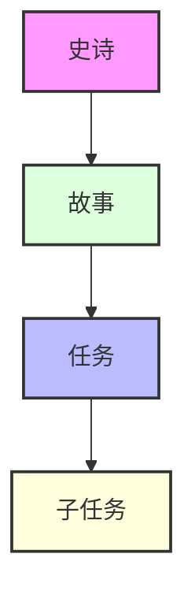
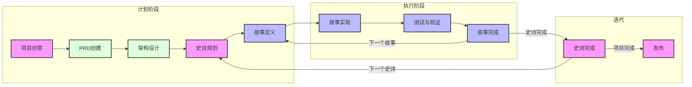

# Cursor敏捷工作流程文档

本文档提供了与Cursor的AI功能集成的敏捷工作流系统的全面文档。该工作流程旨在通过结构化的开发方法保持项目重点并确保持续进展。

## 概述

敏捷-Cursor工作流将传统敏捷方法与AI辅助开发相结合，创建了一个强大、高效的开发流程。它可以通过两种主要方式使用：

1. **基于规则的实现**（自动）

   - 使用`.cursor/rules/`模板
   - 自动将标准应用于匹配的文件
   - 提供一致的结构执行

2. **基于记事本的实现**（灵活）
   - 使用`xnotes/`模板
   - 更轻量级且更适应性强
   - 适合专注的开发会话

## 工作项层次结构



1. **史诗（Epics）**

   - 大型、自包含的功能
   - 一次只能有一个处于活动状态
   - 示例："在线匹配系统"

2. **故事（Stories）**

   - 更小、可实现的工作单元
   - 必须属于一个史诗
   - 示例："用户资料创建"

3. **任务（Tasks）**

   - 技术实现步骤
   - 明确的完成标准
   - 示例："实现数据库架构"

4. **子任务（Subtasks）**
   - 细粒度工作项
   - 通常包括测试要求
   - 示例："编写单元测试"

## 工作流将产生的AI项目计划和记忆结构

```
.ai/
├── prd.md                 # 产品需求文档
├── arch.md               # 架构决策记录
├── epic-1/              # 当前史诗目录
│   ├── story-1.story.md  # 史诗1的故事文件
│   ├── story-2.story.md
│   └── story-3.story.md
├── epic-2/              # 未来史诗目录
│   └── ...
└── epic-3/              # 未来史诗目录
    └── ...
```

## 工作流阶段

### 1. 计划阶段

- 专注于文档和规划
- 只修改`.ai/`、文档、readme和规则
- 需要对PRD和架构进行批准

### 2. 执行阶段

- 实现已批准的进行中故事
- 逐任务执行
- 持续测试和验证



## 实施指南

### 故事实现过程

1. **初始化**

   - 验证`.ai`目录是否存在
   - 定位已批准的架构和当前故事
   - 确保故事被正确标记为进行中

2. **开发流程**

   - 遵循测试驱动开发(TDD)
   - 定期更新任务/子任务状态
   - 记录所有实现注释
   - 记录使用的重要命令

3. **完成要求**
   - 所有测试必须通过
   - 文档必须更新
   - 用户必须批准完成

### 关键规则

> 🚨 **关键规则：**
>
> - 在没有PRD和架构批准的情况下，绝不创建第一个故事
> - 一次只能有一个史诗处于进行中状态
> - 一次只能有一个故事处于进行中状态
> - 故事必须按照PRD指定的顺序实施
> - 没有用户批准的故事（在故事文件中标记为进行中）绝不实施

## 使用工作流

### 基于规则的方法

1. 安装工作流规则：

```bash
./apply-rules.sh /path/to/your/project
```

2. 通过将提供的模板复制到`.cursor/rules`目录中使用：
   - `901-prd.mdc`用于产品需求
   - `902-arch.mdc`用于架构
   - `903-story.mdc`用于故事

### 基于记事本的方法

1. 在Cursor选项中启用记事本
2. 从模板创建记事本：

   - `workflow-agile.md`用于完整工作流
   - `implementation-agile.md`用于故事实现

3. 使用`@notepad-name`访问工作流上下文

> 💡 **提示：** 在以下情况使用记事本方法：
>
> - 初始项目设置（记事本命名为plan-agile）
> - 故事实现（记事本命名为impl-story）
> - 专注的开发会话
> - 减少上下文开销

- 新上下文窗口示例命令：`@plan-agile 我有一个想法<在此描述高级概述>`
- 新上下文窗口示例命令：`@impl-story 我准备开始实现当前进行中的故事中的完整任务`

## 最佳实践

1. **文档**

   - AI会保持PRD和架构文档的更新 - 有时您需要告诉它根据需要更新prd和arch文件。
   - 记录所有重要决策
   - 维护清晰的实现注释

2. **测试**

   - 在实现前编写测试
   - 保持高测试覆盖率
   - 在完成前验证所有测试通过

3. **进度跟踪**

   - 定期更新故事状态
   - 记录所有实现注释
   - 记录命令历史

4. **上下文管理**
   - 每个故事或在记录了重大进展后（在任务完成更新中记录）启动一个新的编辑器实例
   - 使用适当的上下文级别
   - 最小化上下文开销

## 状态进展

故事遵循严格的状态进展：

```
草稿 -> 进行中 -> 完成
```

史诗遵循类似的进展：

```
未来 -> 当前 -> 完成
```

## 与Cursor AI的集成

该工作流设计为与Cursor的AI功能无缝协作：

1. **AI辅助规划**

   - AI帮助创建和完善PRD
   - AI建议架构改进
   - AI协助故事分解

2. **AI辅助实现**

   - AI实现故事任务
   - AI维持测试覆盖率
   - AI更新文档

3. **AI辅助审查**
   - AI验证完成标准
   - AI提出改进建议
   - AI维护一致性

## 成本节约

- 如果您有可用的Cursor外部的LLM，如ChatGPT、Claude、Gemini等，它们也非常适合生成初始PRD和架构，并真正地迭代它们。
- 在Cursor内部，目前您可以使用DeepSeek R1（似乎是免费的），它在更新PRD和架构方面也很不错 - 但我发现它在按照我想要的格式操作方面不如使用Claude可靠 - 但如果尝试在cursor中进行所有规划，它要便宜得多。 